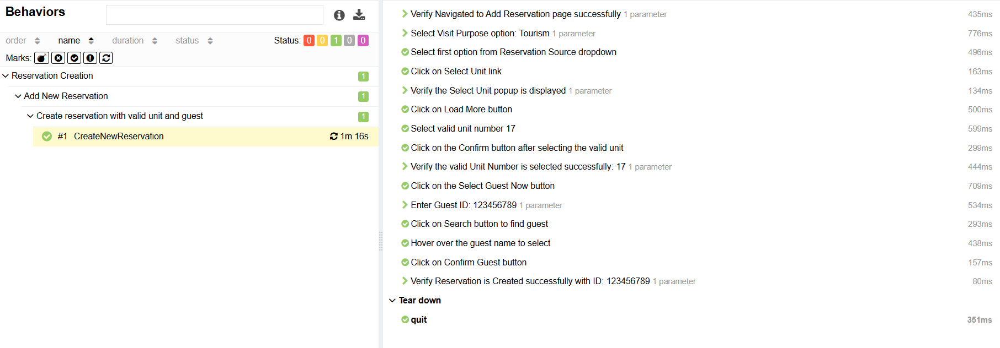

# Nazeel Web Automation Task for Creating Reservation

This project automates the complete reservation process in the **Nazeel** Staging website using **Selenium WebDriver with Java, TestNG, and Maven** frameworks, with test execution reported using **Allure**.
The automation script is designed to simulate a user journey from logging in to successfully creating a reservation, ensuring that all critical functionalities of the reservation system are thoroughly tested.

---
## Technologies Used

| Tool                        | Responsibility                                                                |
|-----------------------------|-------------------------------------------------------------------------------|
| **Java**                    | Programming language used for writing tests.                                  |
| **Selenium WebDriver**      | Interacts with UI elements for automation.                                    |
| **TestNG**                  | Test execution and reporting framework.                                       |
| **Maven**                   | Dependency management and project build automation.                           |
| **Log4j**                   | Logging library for debugging and tracking test execution.                    |
| **Page Object Model (POM)** | Design pattern for modular and maintainable tests.                            |
| **Data-Driven Testing**     | Uses external sources (JSON, Properties) to avoid hard-coded values and improve test maintainability. |
| **Allure**                  | Reporting tool for generating detailed test execution reports.                |
| **Git**                     | Version control system for source code management.                            |
---
## Framework Components

| Module / Layer            | Responsibility                                                                 |
|---------------------------|--------------------------------------------------------------------------------|
| **Driver Management**     | Manages browser drivers using Factory pattern (`Chrome`).   |
| **Configuration Loader**  | Loads test configs and environment data from `.properties` & `JSON` files.     |
| **Data Reader**           | Handles test data extraction from external sources (JSON, properties).         |
| **Page Objects**          | Implements the Page Object Model (POM) for modular and maintainable code.       |
| **Actions Layer**         | Contains reusable methods for UI interactions (clicks, input, scrolling).     |
| **Wait Manager**          | Centralizes explicit and conditional waits for stable execution.               |
| **Time Manager**          | Manages timeouts and execution timing configurations.                           |
| **Assertion Layer**       | Wraps TestNG assertions with custom hard/soft assertion handlers.              |
| **Allure Utility**        | Handles Allure steps, attachments, and reporting helpers.                      |
| **Listeners & Reporting** | Integrates TestNG listeners with Allure for detailed reports and screenshots.  |

---
## Key Features

- Automated login to Nazeel Staging.
- Supports **Manual reCAPTCHA resolution** using a predefined wait time before resuming automation execution.
- Handling post-login popups.
- Navigation to the Reservation page.
- Creating a new reservation (visit purpose & source selection).
- Selecting the unit and the guest via pop-ups.
- Completing new reservation creation.
- Validating successful reservation creation.
---
## Project Structure
```plaintext
Automation_Task/
|
├─── .idea
├─── .mvn
├─── src
│   ├─── main
│   │   ├─── java
│   │   │   └─── com
│   │   │       └─── challenge
│   │   │           ├─── assertions
│   │   │           │       BaseAssertion.java
│   │   │           │       HardAssertion.java
│   │   │           │       SoftAssertion.java
│   │   │           │       
│   │   │           ├─── datareader
│   │   │           │       JsonReader.java
│   │   │           │       PropertyReader.java
│   │   │           │       
│   │   │           ├─── drivers
│   │   │           │       AbstractDriver.java
│   │   │           │       Browser.java
│   │   │           │       ChromeDriverFactory.java
│   │   │           │       GUIFactory.java
│   │   │           │       
│   │   │           ├─── listeners
│   │   │           │       TestNGListeners.java
│   │   │           │       
│   │   │           ├─── media
│   │   │           │       ScreenShotMedia.java
│   │   │           │       
│   │   │           ├─── pages
│   │   │           │       Page01_Login.java
│   │   │           │       Page02_Dashboard.java
│   │   │           │       Page03_Reservation.java
│   │   │           │       Page04_AddReservation.java
│   │   │           │       
│   │   │           └─── utils
│   │   │                │   AllureUtil.java
│   │   │                │   TimeManager.java
│   │   │                │   WaitManager.java
│   │   │                │   
│   │   │                ├─── actions
│   │   │                │       BrowserAction.java
│   │   │                │       ElementAction.java
│   │   │                │       
│   │   │                └─── logs
│   │   │                       LogsManager.java
│   │   │                       
│   │   └─── resources
│   │        │   allure.properties
│   │        │   enviroment.properties
│   │        │   log4j2.properties
│   │        │   wait.properties
│   │        │   webapp.properties
│   │        │   
│   │        └─── META-INF
│   │             └─── services
│   │                    └─── org.testng.ITestNGListener
│   │                   
│   └─── test
│        ├─── java
│        │   └─── tests
│        │         └─── BaseClass.java
│        │         └─── Task_TC.java
│        │           
│        └─── resources
│              └─── Test_Data
│                    └─── Data.json
├─── target
│               
└─── Test-out
│    ├─── allure-report
│    │      └─── index.html
│    ├─── allure-results
│    └─── Logs
│    └─── screenshots
│
│           
└───test_result_screen
        └─── CreateNewReservation_Screen1.png
        └─── CreateNewReservation_Screen2.png
│
└─── .gitattributes
└─── .gitignore
└─── test.xml
└─── generate-allureReport.bat
└─── pom.xml
└─── README.md
```
---

## 🚀 How to Run
Run tests using the following Maven commands (via `.bat` or terminal):

### ⚡ Main Test Execution:
 
```bash
  mvn clean test -Dtest=Task_TC
  ```
- Allure Report is automatically generated via a `.bat` file using CMD.  
- After the report is generated, copy the folder path and paste it into your browser's address bar, then add `/index.html` at the end of the path to view the report.
---

## 🖼️ Test Report Screen
- Allure is configured to generate detailed HTML reports with screenshots for failed steps.
- Reports are stored in the `Test-out/allure-report` directory and can be accessed by opening the `index.html` file in a web browser.
- The report includes test execution status, step details, and attached screenshots for failed tests, providing comprehensive insights into the test results.

### 🔹 Login To Successful Reservation Creation Report Screen




---
